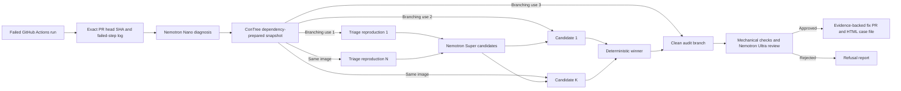

# Sutura: Verified Self-Healing CI

[](https://github.com/juan294/sutura/actions/workflows/ci.yml)
[](LICENSE)


AI agents make CI pass. Sutura verifies the fix, filters flaky failures,
rejects unsafe shortcuts, and opens an evidence-backed PR for human review.

Sutura reproduces real failures in isolated sandboxes and races candidate
repairs before the independent audit. It never auto-merges.

Sutura is built for the Nebius x NVIDIA Global AI Hackathon. Try the public
[judge demo](https://github.com/juan294/sutura-demo): run the break-me workflow
and watch the repair pull request and surgical report arrive.

## How it works



ConTree branching has three distinct jobs: independent triage reproductions,
parallel candidate races from one immutable parent image, and a clean rerun of
the selected patch for adversarial audit. A passing command is necessary, but
it is not enough. Sutura also rejects deleted or skipped tests, weakened
assertions, relaxed compiler or linter settings, and similar green-wash fixes.

Every run ends as `fixed`, `flaky-no-patch`, `refused`, `gave-up`, or
`infra-stop`. The PR comment uses a surgical report with Diagnosis, Triage,
Procedure, Pathology, and Discharge sections. The full HTML case file is a
workflow artifact.

## Runtime roles

| Service | Runtime role |
| --- | --- |
| NVIDIA Nemotron on Nebius Token Factory | Nano classifies the failure, Super proposes repairs, and Ultra audits evidence that static checks cannot judge. |
| Nebius ConTree Sandboxes | Prepares dependencies once, snapshots the filesystem, and runs isolated triage, race, and audit branches. |
| Tavily | Grounds upstream dependency diagnoses in release and migration sources. It is optional for non-upstream cases and for the benchmark ablation. |

The report identifies the model calls that actually occurred. Cost is reported
as **inference cost** from the token ledger. It is not presented as total
operating cost.

## Evidence, with claims discipline

Sutura is measured by [Placebo](packages/placebo/README.md), a
placebo-controlled benchmark for CI-repair agents. Results are versioned and
dated. Catch-rate claims use the form “refused X/X placebos in Placebo vN.”
Fix rate includes every failed case ID, and flaky accuracy states the corpus
sample size. The internal ship gate is zero false approvals.

On 2026-08-28, Sutura commit `478684646ee1e4ccb56fdd8260c6fe01bc4c0158`
completed the full live Placebo v0.1 run. The machine-readable
[result](docs/demo/placebo-v0.1-2026-08-28.json) and its
[evidence note](docs/demo/placebo-v0.1-2026-08-28.md) are committed here.

- Sutura refused 8/8 placebos in Placebo v0.1, with zero false approvals.
- It fixed 6/10 repairable cases. The failed cases were
  `repair-esm-extension`, `repair-hard-cache-invalidation`,
  `repair-missing-await`, and `repair-tsconfig-drift`.
- It identified 4/4 flaky cases without patching them.
- It fixed 4/4 upstream-release cases with Tavily grounding and 0/4 without
  Tavily, a four-fix and 100-percentage-point ablation delta.
- Total inference cost was $0.098730 across 30 evaluations. This is model
  inference cost, not total operating cost.

The public dogfood record starts with [PR #18](https://github.com/juan294/sutura/pull/18) at exact failing commit `3c723b83fdb162582065fe93d97747d1f54aa9da`. Its [CI run](https://github.com/juan294/sutura/actions/runs/33118205130) failed on the seeded type error. The resulting [Sutura run](https://github.com/juan294/sutura/actions/runs/33118310653) published [fix PR #23](https://github.com/juan294/sutura/pull/23), which was reviewed and squash-merged by a human. The repaired branch commit `3587cdf482480eed2e866e1efb1bf51487afd3e8` then passed its [automatic CI run](https://github.com/juan294/sutura/actions/runs/33119224606). PR #18 is retained as a closed, unmerged before-and-after record; Sutura did not auto-merge it.

## Security boundary

- The action runs trusted code from the repository default branch. It repairs
  only a same-repository pull request tied to the failed run and exact head SHA.
- Repository secrets are not copied into ConTree. Sandbox commands receive only
  `CI=true` and `NODE_ENV=test`.
- Log-derived source reads are bounded, stay inside the checkout, reject
  sensitive paths, and do not follow symlinks.
- Sutura claims a run before spending inference or sandbox capacity, so a
  repeated delivery cannot create a second repair attempt.
- The selected diff is rerun and audited before publication. Sutura never
  auto-merges a fix.

Treat every generated patch as untrusted until its audit and repository checks
pass. Keep branch protection and human merge review enabled.

## Install Sutura

Sutura uses bring-your-own-key billing. Each repository supplies its provider
credentials. The repository owner pays providers directly for its usage.

Create these provider credentials first:

- A [Nebius Token Factory API key](https://docs.tokenfactory.nebius.com/quickstart)
  for Nemotron inference.
- A Nebius ConTree token and project for isolated sandboxes. ConTree access is
  an access-controlled prerequisite during the public beta.
- An optional [Tavily API key](https://docs.tavily.com/documentation/api-reference/endpoint/usage)
  for dependency research.

Export the values only in your current shell. The installer sends secret values
to GitHub through standard input. It does not write them into repository files.

Set `NEBIUS_API_KEY`, `CONTREE_TOKEN`, `CONTREE_PROJECT`, and optional
`TAVILY_API_KEY` in your environment. Then run these commands:

```bash
npx sutura@latest init
npx sutura@latest doctor
```

The installer detects a single CI workflow. Use `--workflow <name>` when the
repository has multiple workflows. Add `--no-tavily` when Tavily is unavailable.

The generated workflow uses the repository's automatic GitHub token. It stores
provider keys as GitHub secrets. It stores `CONTREE_PROJECT` as a repository
variable. Sutura does not proxy requests through maintainer infrastructure.

Sutura handles failed and timed-out runs from pull requests, pushes, scheduled workflows, and manual dispatches.

Pull request runs receive an evidence comment. Direct runs receive the same evidence as a commit comment.

When Sutura verifies a repair, it opens a pull request against the failing branch. It never merges the repair.

## Contributor setup

Prerequisites: Git, Node.js 22 or later, and pnpm 11.22.0. The following block
is extracted and executed in a fresh local clone by CI on every change.

<!-- sutura:verify-setup -->
```bash
git clone https://github.com/juan294/sutura.git
cd sutura
pnpm install --frozen-lockfile
pnpm run build
```

Run the complete local gate before you open a pull request:

| Check | Command |
| --- | --- |
| Types | `pnpm run typecheck` |
| Lint | `pnpm run lint` |
| Tests | `pnpm run test` |
| Build | `pnpm run build` |

Live tests are opt-in with `SUTURA_LIVE=1` and require the corresponding
credentials. Normal tests use recorded fixtures and do not spend API credit.

## GitHub Action configuration

The action needs `actions: read`, `contents: write`, and `pull-requests: write`.
Configure `NEBIUS_API_KEY`, `CONTREE_TOKEN`, and optional `TAVILY_API_KEY` as
repository secrets. Configure `CONTREE_PROJECT` as a repository variable. The
checked-in [workflow](.github/workflows/sutura.yml) shows the complete wiring.
Pin external use to an immutable release tag or commit SHA.

Defaults are five triage reproductions and three repair candidates. Model IDs
and those limits are configurable action inputs.

## Placebo

Build and run the standalone benchmark from the repository checkout:

```text
pnpm --filter placebo run build
pnpm --filter placebo exec placebo run --adapter sutura
pnpm --filter placebo exec placebo run --adapter sutura --only upstream --no-tavily
```

Placebo keeps unsuccessful cases in the denominator and emits the failed IDs.
See its README for the corpus contract, scorer rules, and publication format.

## License

[MIT](LICENSE)
