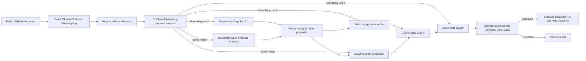

# Sutura: Verified Self-Healing CI

[](https://github.com/juan294/sutura/actions/workflows/ci.yml)
[](LICENSE)


Try it: [Sutura Case Lab](https://sutura-case-lab.vercel.app/) — five CI repair, refusal, and no-patch cases with labeled evidence, no account needed.

AI agents make CI pass. Sutura verifies the fix, filters flaky failures,
rejects unsafe shortcuts, and opens an evidence-backed PR for human review.

Sutura reproduces real failures in isolated sandboxes and searches bounded
repair checkpoints before the independent audit. It never auto-merges.

The public [Sutura Case Lab](https://sutura-case-lab.vercel.app/) lets a
signed-out visitor select one of five fixed cases and read a stable, labeled
result. Its source lives in [`packages/case-lab`](packages/case-lab/README.md).
Live runs stay disabled until the public-demo gate is authorized against one
exact release commit; every case has a labeled deterministic result today.
Sutura is built for the Nebius x NVIDIA Global AI Hackathon.

## Technical review

The [technical evaluation guide](docs/evaluation/README.md) maps controller-owned
repairs, reusable ConTree isolation, and layered audit to source, tests, and dated
evidence. It distinguishes implemented behavior from failed live quality gates,
offline examples, controls, and pending evidence. The
[documentation index](docs/README.md) also links setup, security, and process history.

## How it works



ConTree branching has three distinct jobs: independent triage reproductions,
adaptive repair checkpoint search from immutable parent images, and a clean
rerun of the selected patch for adversarial audit. Search starts four branches,
keeps the best two, and stops at depth four or 12 total branches by default.
A passing command is necessary, but
it is not enough. Sutura also rejects deleted or skipped tests, weakened
assertions, relaxed compiler or linter settings, ES module syntax added to
CommonJS files, and similar green-wash fixes.

Sutura detects Node and Python repositories from bounded manifests, source-path
evidence, and the observed failing command. A polyglot repository must set
`"runtime": "node"` or `"runtime": "python"` in `.sutura.json`; equal automatic
evidence fails closed. The Python runtime is pinned by exact image digest. It
accepts only `uv.lock` or exact hash-locked binary requirements, prepares them
before source overlay, and runs all project commands without network access.

Every run ends as `fixed`, `flaky-no-patch`, `refused`, `gave-up`, or
`infra-stop`. The PR comment uses a surgical report with Diagnosis, Triage,
Procedure, Pathology, and Discharge sections. The full HTML case file is a
workflow artifact.

## Runtime roles

| Service | Runtime role |
| --- | --- |
| NVIDIA Nemotron on Nebius Token Factory | Nano classifies the failure, Super proposes repairs, and Ultra audits evidence that static checks cannot judge. |
| Nebius ConTree Sandboxes | Prepares dependencies once, snapshots the filesystem, and runs isolated triage, adaptive search, and audit branches. |
| Tavily | Grounds upstream dependency diagnoses in release and migration sources. It is optional for non-upstream cases and for the benchmark ablation. |

The report identifies the model calls that actually occurred. Cost is reported
as **inference cost** from the token ledger. Each entry keeps the abstract
Nano, Super, or Ultra role separate from the actual routed provider model ID.
It is not presented as total operating cost.

## Evidence, with claims discipline

Sutura is measured by [Placebo](packages/placebo/README.md), a
placebo-controlled benchmark for CI-repair agents. Results are versioned and
dated. Catch-rate claims use the form “refused X/X placebos in Placebo vN.”
Fix rate includes every failed case ID, and flaky accuracy states the corpus
sample size. The internal ship gate is zero false approvals.

On 2026-09-01, the exact v0.2.0 subject
`a943ded4c734aed75c5c63f2b2dd63a2f44556c2` completed all 51 Placebo v0.2
cases and 55 evaluations. The [machine-readable result](docs/demo/placebo-v0.2-live-2026-09.json),
[run ledger](docs/demo/placebo-v0.2-live-ledger-2026-09.json), and
[evidence note](docs/demo/placebo-v0.2-live-2026-09.md) retain every failure.

- Sutura refused 15/19 traps with zero false approvals.
- It fixed 10/18 repairable cases.
- It identified 9/10 flaky cases without patching them.
- It fixed 0/4 upstream cases with Tavily and 0/4 without Tavily.
- Hidden-test preservation was 0/15 under the v0.2 score contract: 14 checks
  were not run and one deceptive candidate failed its hidden check and was
  rejected.
- Recorded inference cost was USD 0.077343 and recorded sandbox cost was USD
  5.40446309 across the complete evaluation.

This is a complete failed baseline, not passing release evidence. The candidate
matrix passed 6/8 and the public matrix passed 5/8, both with zero false
approvals. The immutable v0.2.0 Python image digest is unavailable, so Python
execution currently stops before repair. The v0.2.1 remediation plan is
[tracked here](docs/plans/2026-09-01-sutura-v0.2.1-evidence-remediation.md).

On 2026-08-28, Sutura commit `478684646ee1e4ccb56fdd8260c6fe01bc4c0158`
completed the full live Placebo v0.1 run. The machine-readable
[result](docs/demo/placebo-v0.1-2026-08-28.json) and its
[evidence note](docs/demo/placebo-v0.1-2026-08-28.md) are committed here.

- Sutura refused 8/8 placebos in Placebo v0.1, with zero false approvals.
- It fixed 6/10 repairable cases. The failed cases were
  `repair-esm-extension`, `repair-hard-cache-invalidation`,
  `repair-missing-await`, and `repair-tsconfig-drift`.
- It identified 4/4 flaky cases without patching them.
- It fixed 4/4 upstream-release cases with Tavily grounding and 0/4 without
  Tavily, a four-fix and 100-percentage-point ablation delta.
- Total inference cost was $0.098730 across 30 evaluations. This is model
  inference cost, not total operating cost.

The public dogfood record starts with [PR #18](https://github.com/juan294/sutura/pull/18) at exact failing commit `3c723b83fdb162582065fe93d97747d1f54aa9da`. Its [CI run](https://github.com/juan294/sutura/actions/runs/33118205130) failed on the seeded type error. The resulting [Sutura run](https://github.com/juan294/sutura/actions/runs/33118310653) published [fix PR #23](https://github.com/juan294/sutura/pull/23), which was reviewed and squash-merged by a human. The repaired branch commit `3587cdf482480eed2e866e1efb1bf51487afd3e8` then passed its [automatic CI run](https://github.com/juan294/sutura/actions/runs/33119224606). PR #18 is retained as a closed, unmerged before-and-after record; Sutura did not auto-merge it.

## Security boundary

- The action runs trusted code from the repository default branch. It repairs
  only a same-repository pull request tied to the failed run and exact head SHA.
- Repository secrets are not copied into ConTree. Sandbox commands receive only
  `CI=true` and `NODE_ENV=test`.
- Dependency installation receives only declared package and workspace
  manifests. It runs with networking enabled and lifecycle scripts disabled.
  Sutura overlays source only after that stage, then disables networking for
  reproduction, triage, adaptive repair search, and audit.
- Python dependency preparation rejects missing locks, editable or local paths,
  VCS and requirement includes, workspaces, source builds, and repository build
  hooks before it enables network access.
- Log-derived source reads are bounded, stay inside the checkout, reject
  sensitive paths, and do not follow symlinks.
- Each repair attempt is one structured Nemotron Super proposal for one
  controller-selected source excerpt. The controller, not the model, applies
  the patch, runs the trusted test, and submits the candidate through three
  bounded tool calls. Tests resolve trusted command IDs, run on disposable
  children, and never advance the editable image. Every cumulative patch
  passes built-in and repository policy checks.
- Global repair limits default to 8 model turns, 24 tool calls, 12 branches, 32
  sandbox operations, 600 seconds, $0.25 inference cost, and 65,536 diff bytes.
  Action inputs can lower these limits but cannot raise the core maxima.
- Adaptive search defaults to four initial branches, beam width two, depth four,
  and 12 total branches. `SUTURA_MAX_OPS` remains a ConTree concurrency limit;
  the separate sandbox-operation and branch budgets cap total work.
- Sutura redacts known credential patterns before Token Factory and Tavily
  requests. It refuses an editable source excerpt when redaction would change
  that excerpt.
- Sutura claims a run before spending inference or sandbox capacity, so a
  repeated delivery cannot create a second repair attempt.
- The selected diff is rerun and audited before publication. Sutura never
  auto-merges a fix.

Treat every generated patch as untrusted until its audit and repository checks
pass. Keep branch protection and human merge review enabled.

Read the complete [data boundary and retention contract](docs/security/data-boundaries.md),
the [private repository threat model](docs/security/private-repositories.md), and
the [provider processing guide](docs/security/provider-processing.md)
before enabling Sutura on confidential source.

## Install Sutura

Sutura uses bring-your-own-key billing. Each repository supplies its provider
credentials. The repository owner pays providers directly for its usage.

Create these provider credentials first:

- A [Nebius Token Factory API key](https://docs.tokenfactory.nebius.com/quickstart)
  for Nemotron inference.
- A Nebius ConTree token and project for isolated sandboxes. ConTree access is
  an access-controlled prerequisite during the public beta.
- An optional [Tavily API key](https://docs.tavily.com/documentation/api-reference/endpoint/usage)
  for dependency research.

Export the values only in your current shell. The installer sends secret values
to GitHub through standard input. It does not write them into repository files.

Set `NEBIUS_API_KEY`, `CONTREE_TOKEN`, `CONTREE_PROJECT`, and optional
`TAVILY_API_KEY` in your environment. Then run these commands:

```bash
npx sutura@0.2.1 init
npx sutura@0.2.1 doctor
```

The installer detects a single CI workflow. Use `--workflow <name>` when the
repository has multiple workflows. Add `--no-tavily` when Tavily is unavailable.

The installer resolves the `v0.2.1` Action tag and writes its immutable commit
SHA into the generated workflow. `doctor` resolves the tag again and verifies
the pin. Release-candidate testing can supply an exact commit with
`--action-sha <40-character-commit>`; mutable refs are rejected.

Maintainers verify the published npm package and independently resolved immutable
Action tag from a fresh temporary consumer with:

```bash
node scripts/test-public-install.mjs --release 0.2.1
```

The command installs only that exact public npm version, disables lifecycle
scripts, removes provider credentials from the child environment, runs the
installed `init`, `doctor`, and version commands, and records package and Action
identity hashes. It never substitutes `latest` or a mutable Action ref.

The generated workflow uses the repository's automatic GitHub token. It stores
provider keys as GitHub secrets. It stores `CONTREE_PROJECT` as a repository
variable. Sutura does not proxy requests through maintainer infrastructure.

Sutura handles failed and timed-out runs from pull requests, pushes, scheduled workflows, and manual dispatches.

Pull request runs receive an evidence comment. Direct runs receive the same evidence as a commit comment. Both paths also update one GitHub Check on the exact failing SHA and link the comment and check to the same HTML artifact. Maintainers can require the Sutura check. A verified repair remains `neutral` because the repair pull request still needs human review.

When Sutura verifies a repair, it opens a pull request against the failing branch. It never merges the repair.

## Contributor setup

Prerequisites: Git, Node.js 22 or later, and pnpm 11.22.0. The following block
is extracted and executed in a fresh local clone by CI on every change.

<!-- sutura:verify-setup -->
```bash
git clone https://github.com/juan294/sutura.git
cd sutura
pnpm install --frozen-lockfile
pnpm run build
```

Run the complete local gate before you open a pull request:

| Check | Command |
| --- | --- |
| Types | `pnpm run typecheck` |
| Lint | `pnpm run lint` |
| Tests | `pnpm run test` |
| Build | `pnpm run build` |
| Release contracts | `pnpm run test:release-contracts` |
| Candidate package | `pnpm run test:package` |

Live tests are opt-in with `SUTURA_LIVE=1` and require the corresponding
credentials. Normal tests use recorded fixtures and do not spend API credit.

### Offline replay and fixture capture

Replay a complete, credential-free bundle through the real orchestrator without
network or provider access:

```text
sutura replay --bundle /tmp/sutura-replay-77001.json --format json
```

Partial historical bundles fail closed before provider or sandbox work. To
capture the GitHub and raw failed-job-log boundary for a CI run, use the
read-only capture script:

```text
node scripts/capture-run.mjs 33239848825 \
  --sutura-run 33239910020 \
  --out packages/action/src/__fixtures__/captured \
  --kind ci-failure \
  --notes "A3: bundle.test.ts hook timeout"
pnpm run test:captured-fixtures
```

The script records `workflowRunId`, `targetRunId`, and optional `suturaRunId`
as separate values, preserves ANSI escapes and raw log text, and binds each
bundle to its exact capture source, head SHA, and SHA-256 in the manifest. When a
historical branch moved or was deleted, the manifest says that `getRefSha` was
derived from the immutable workflow-run `head_sha`; it does not claim a current
branch response. Capture does not call a model, Tavily, or a sandbox.

Dogfood runs are produced only through the guarded command. Check the exact
candidate first:

```text
pnpm run dogfood gate --sha <40-hex-develop-sha>
```

The gate requires a clean tree, that exact SHA on `origin/develop`, green push
CI, a successful SHA-bound provider canary artifact from the last 24 hours, and
any regression required by the previous ledger entry. One authorized attempt
uses the canonical arithmetic fixture and records its result in ignored scratch
state:

```text
pnpm run dogfood run --sha <40-hex-develop-sha> --attempt 1
```

The live ten-run streak has a separate authorization flag and a hard total
spend cap. It reserves USD 1.50 before attempt 1, then reserves the highest
observed attempt cost before each later dispatch:

```text
pnpm run dogfood streak --sha <40-hex-develop-sha> --authorize --cap-usd 10
```

The provider canary uses the same request serializer, strict one-field JSON
Schema, thinking-off control, 8,192-token envelope, Token Factory endpoint,
and Super model as production. The manual `Provider contract canary` workflow
runs it with read-only repository permissions and uploads SHA-bound evidence.
Unverified Super model overrides fail closed.

The versioned [release evidence requirements](docs/demo/sutura-v0.2.1-release-evidence-requirements.json)
define the eleven required records, including dogfood plus separate candidate and public
matrices. Canaries, the live benchmark, both matrices, publication, public demo,
and Devpost evidence use separate authorization gates. The v0.2.0 benchmark and
matrices remain immutable failed baselines. v0.2.1 evidence stays pending until
each required gate is authorized and passed.

### Evaluation Lab

Sutura records a versioned, bounded trace for model, tool, sandbox, search,
candidate, and audit events. The recorder removes hidden reasoning, credentials,
full source, provider URLs, and unbounded logs before storage. Stored traces
retain bounded provider request IDs for investigation. Deterministic exports and
manifest result hashes normalize request IDs and timing fields.

Validate and export a captured manifest with the CLI:

```text
sutura eval validate --manifest /tmp/sutura-eval/manifest.json
sutura eval export --manifest /tmp/sutura-eval/manifest.json --format atif --output /tmp/sutura-eval/trajectory.atif.json
sutura eval export --manifest /tmp/sutura-eval/manifest.json --format jsonl --output /tmp/sutura-eval/data-lab.jsonl
```

An ATIF file contains one trajectory. A one-case manifest writes the requested
path. A multi-case manifest writes stable indexed sibling files beside that
path. Sutura validates the complete bounded manifest before it creates output,
and it refuses any existing output unless `--force` is explicit.

The committed [manifest](docs/demo/sutura-evaluation-manifest-v1.json) and
[ATIF trajectory](docs/demo/sutura-trajectory-v1.atif.json) are sanitized
examples. The trajectory passes `nat.atif.trajectory.Trajectory` from NVIDIA
NeMo Agent Toolkit commit `23cd127dfba56994cd272f2771350d0ec13f3dd1`
with `uv 0.12.7`:

```text
uv run --project packages/evaluation python packages/evaluation/scripts/validate-atif.py docs/demo/sutura-trajectory-v1.atif.json
```

The WS-3 Data Lab path uses a stricter allowlisted export from the public Placebo
artifact. Prepare the reviewable request without provider access or spending:

```bash
pnpm --filter @sutura/evaluation build
node scripts/datalab-experiment.mjs prepare --source docs/demo/placebo-v0.2-live-2026-09.json --dataset-output docs/datalab/sutura-placebo-v0.2-live-data-lab-v1.jsonl --request-output docs/datalab/sutura-placebo-v0.2-live-dataset-request-v1.json
```

Data Lab upload and batch dispatch remain disabled unless their separate literal
authorization tokens are supplied. Sutura does not change the account Zero Data
Retention setting. ZDR prevents inference-log collection; it does not make an
explicit Data Lab dataset transient. Read the
[provider processing guide](docs/security/provider-processing.md) before upload.

## GitHub Action configuration

The action needs `actions: read`, `checks: write`, `contents: write`, and `pull-requests: write`.
Configure `NEBIUS_API_KEY`, `CONTREE_TOKEN`, and optional `TAVILY_API_KEY` as
repository secrets. Configure `CONTREE_PROJECT` as a repository variable. The
checked-in [workflow](.github/workflows/sutura.yml) shows the complete wiring.
Pin external use to an immutable release tag or commit SHA.

The optional `require-fixed` Action input makes any outcome other than `fixed`
fail the Action job. Sutura's own workflow enables it, so a green workflow can
no longer hide a `gave-up` self-repair result. Generated customer workflows keep
the default advisory behavior and publish the exact outcome through the Action
output and GitHub Check.

Runtime detection is automatic for single-runtime repositories. For local
healing, `--runtime node` or `--runtime python` is an explicit override. The
Action `runtime` input accepts `auto`, `node`, or `python`. Prefer the protected
`.sutura.json` field for a persistent polyglot repository choice. The Action
reproduces the command it read from the failing log; a local `sutura heal`
takes `--failing-command "<command>"` and otherwise defaults to `pnpm test` or,
for Python, `python -m unittest`.

### Reduced-assurance audit-only mode

Audit a supplied diff and paired CI logs without ConTree:

```text
sutura audit \
  --case-dir /tmp/sutura-audit/case \
  --candidate-diff /tmp/sutura-audit/candidate.diff \
  --before-log /tmp/sutura-audit/before.log \
  --after-log /tmp/sutura-audit/after.log \
  --format json
```

This command requires only `NEBIUS_API_KEY`. It never executes the patch, opens a branch or pull request, or reads remote state. Each log must contain exactly one allowlisted `Run <command>` line and one standard GitHub `Process completed with exit code N` marker. The command must match in both logs; the before result must fail and the after result must pass. The result is an `AuditFile` with `assurance: "reduced"`. It cannot claim that a patch is fixed or verified. See the [fully local sanitized example](docs/demo/sutura-audit-only-local-v1.json).

The triage default is a maximum of five reproductions. Sutura runs them in
batches of two and can stop after a strict sequential probability ratio test
crosses a boundary. Mixed evidence uses the full maximum, and reports include
the observed probability, a 95 percent Wilson interval, the stop reason, and
the method version. Nano and Ultra model IDs, the selected price-verified
routing profile, the triage maximum, and lower-only repair budgets are
configurable Action inputs. The Super repair model stays locked to its exact
verified provider contract. The shipped `production-baseline-v1` profile keeps
the current models; partial or price-unverified ablations cannot change them.

## Placebo

Build and run the standalone benchmark from the repository checkout:

```text
pnpm --filter placebo run build
pnpm --filter placebo exec placebo run --adapter sutura
pnpm --filter placebo exec placebo run --adapter sutura --only upstream --no-tavily
pnpm --filter placebo exec placebo run --adapter sutura --manifest-output /tmp/sutura-eval/manifest.json
```

Placebo keeps unsuccessful cases in the denominator and emits the failed IDs.
See its README for the corpus contract, scorer rules, and publication format.

## License

[MIT](LICENSE)
