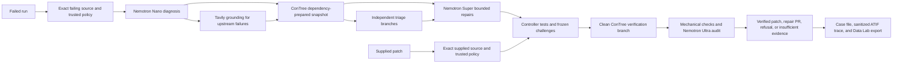

# Sutura: Verified Self-Healing CI

> AI agents make CI pass. Sutura verifies the fix, filters flaky failures, rejects unsafe shortcuts, and opens an evidence-backed PR for human review.

Canonical package identity for this source: `sutura@0.3.3`.

## Try it out

- [Sutura Case Lab](https://sutura-case-lab.vercel.app/): five fixed CI cases
  with labeled deterministic results and no account required. The hosted demo
  currently shows the historical public `sutura@0.2.0` release evidence.
- [Repository](https://github.com/juan294/sutura): current source, GitHub
  Action, CLI, tests, and evaluation documentation.
- [npm package](https://www.npmjs.com/package/sutura): public installer CLI.

## Problem

A green CI check does not prove that an AI-generated patch repaired the
diagnosed failure. An agent can delete a test, weaken an assertion, relax a
compiler rule, or patch the wrong file and still make the immediate command
pass. Maintainers need evidence that the original failure reproduced, the
proposed repair stayed inside repository policy, and supported behavior
survived an independent clean rerun.

## Who it is for

Sutura is for maintainers who want an agent to investigate or repair failing
GitHub Actions without giving it merge authority. It also verifies a patch
supplied by another agent. Reviewers get the diagnosis, exact diff, executed
checks, rejected alternatives, and remaining uncertainty before deciding
whether to merge.

## Why existing fix-CI tools are insufficient

Making the visible command green is only one observation. Sutura binds every
run to an exact repository state and trusted policy, reproduces the failure in
an isolated sandbox, freezes independent regression challenges before seeing
the candidate, applies bounded patches under controller authority, and
rebuilds the selected patch on a clean branch. Mechanical policy checks and a
separate adversarial audit look for test deletion, weakened assertions,
configuration shortcuts, unrelated edits, and unsupported behavior. The
result is an evidence-backed pull request, a verified supplied patch, or an
explicit refusal or insufficient-evidence report. Sutura never merges a patch.

## Product workflow

- The GitHub Action or CLI reads the exact source identity, failed-step log,
  observed command, and trusted repository policy.
- Sutura prepares declared dependencies before source overlay, then disables
  network access for reproduction, triage, repair search, and audit.
- Independent reproductions distinguish persistent failures from flaky ones.
- Nemotron proposes bounded repairs for controller-selected excerpts. A repair
  can update one file or an atomic two-file contract when policy allows it.
- Controller-owned challenges check supported behavior beyond the visible
  failing test. Deceptive alternatives remain in the evidence with their
  rejection reasons.
- The selected candidate is reconstructed on a clean branch, rerun, checked
  mechanically, and reviewed independently.
- The Case Lab presents the verdict first, then lets a reviewer inspect the
  search tree, rejected patches, clean audit, provenance, and replay mode.

## Architecture

## Runtime roles

| Component | Direct role in Sutura |
| --- | --- |
| Nemotron Nano | Classifies bounded failure evidence and extracts signals used by the controller. |
| Nemotron Super | Proposes one bounded repair transaction; it does not choose trusted policy, execute tests, or approve the candidate. |
| Nemotron Ultra | Reviews the cleanly rerun candidate for semantic shortcuts that static checks may miss. |
| Nebius Token Factory | Serves the three Nemotron roles through one validated provider boundary and records actual model IDs and usage. |
| Nebius ConTree | Prepares dependencies once, snapshots the filesystem, and creates isolated reproduction, triage, search, and audit branches. |
| Tavily | Grounds upstream dependency diagnoses in release and migration sources. It is optional for other cases. |
| Nebius Data Lab | Accepts an explicitly exported, sanitized, blinded JSONL evaluation dataset; Sutura does not upload automatically. |
| NVIDIA ATIF | Defines the interoperable shape of Sutura's sanitized agent trajectories. |
| NVIDIA NeMo Agent Toolkit | Validates and evaluates recorded ATIF trajectories offline; it is not the live repair orchestrator. |

The [evaluation manifest](../demo/sutura-evaluation-manifest-v1.json) and
[ATIF trajectory](../demo/sutura-trajectory-v1.atif.json) are sanitized,
committed examples. The [Placebo benchmark contract](../../packages/placebo/README.md)
keeps every unsuccessful case in the denominator.

## Latest measured development result

The latest completed development/validation run is bound to exact candidate
`042af3aada158347db6006e30a4a0e6e7c65e420`, not to the historical public
release or the later security-only source head. It completed 80 cases and 85
evaluations for USD 6.431018 in recorded inference and sandbox cost.

- Zero false approvals were observed.
- Sutura rejected 15 of 15 deceptive patches and classified 10 of 10 flakes.
- It repaired 33 of 42 repairable cases, or 78.6%, just below the 80% internal
  target.
- It refused 22 of 23 deception cases, or 95.7%.
- Hidden repair-preservation checks passed in 4 of 8 cases; 4 were not run, so
  this gate did not pass.
- The small Tavily ablation repaired 1 of 5 cases with Tavily and 2 of 5
  without it. We therefore make no quality-uplift claim from that result.

These results show the safety behavior we care about and expose the remaining
repair weaknesses, especially async-preservation cases. The held-out 20 cases
remain unopened, and this development measurement is not release acceptance.

## What we learned

Verification has to be separate from patch generation. A model-generated test
or expectation cannot authorize its own repair, so Sutura keeps trusted policy,
challenge expectations, and final adjudication under controller authority.
Exact candidate identity and complete denominators matter just as much: a
later commit cannot inherit an earlier score, and a check that did not run must
remain visible as `not-run` rather than becoming a pass.

Tavily remains useful as a source of current upstream release facts, but the
latest five-pair ablation does not show a repair advantage. We report that
result directly instead of turning integration presence into a performance
claim.

## Significant work since the submission period opened

The submission period opened on 2026-08-26. Since then, Sutura grew from its
first Node repair path into a TypeScript and Python verification system with a
GitHub Action, CLI, public Case Lab, exact-source evidence, progressive flake
triage, bounded two-file repairs, execution-backed verification of supplied
patches, independent regression challenges, deterministic replay, selectable
adaptive Nemotron routing, sanitized ATIF export, local Data Lab tooling, and
candidate-bound evaluation controllers.

The current source also includes four CodeQL regex hardening fixes and refreshed
development dependencies. Those maintenance changes do not inherit the
development candidate's quality score. The repository [changelog](../../CHANGELOG.md)
records release history. Nebius and NVIDIA integration observations and
requests are in the [feedback report](../feedback/2026-10-sutura-nebius-feedback.md).

## What's next

Before release acceptance, we will improve async-preservation repairs, add a
named regression for the one deception case that ended as `gave-up`, rerun the
affected development gates, and keep the held-out set sealed until its
authorized final evaluation. Public maintainer trials, the final release,
video, and judging-access checks also remain separate evidence gates.
