# Sutura: Verified Self-Healing CI

> AI agents make CI pass. Sutura verifies the fix, filters flaky failures, rejects unsafe shortcuts, and opens an evidence-backed PR for human review.

Canonical package identity for this source: `sutura@0.2.1`.

## Try it out

- [Sutura Case Lab](https://sutura-case-lab.vercel.app/): five fixed cases with
  labeled deterministic results; no account needed. Live runs stay disabled
  until the public-demo gate is authorized.
- [Repository](https://github.com/juan294/sutura): source, Action, and evidence.
- [npm package](https://www.npmjs.com/package/sutura): the `sutura` installer CLI.

## Problem

A green CI check does not prove that a generated patch repaired the diagnosed
failure. An agent can delete a test, weaken an assertion, relax a compiler
rule, or patch the wrong file and still make the immediate command pass. Teams
need evidence that the original failure reproduced, the proposed repair stayed
inside repository policy, and the accepted change survived a clean rerun.

## Who it is for

Sutura is for maintainers who want an agent to investigate and repair failing
GitHub Actions without handing it merge authority. It fits repositories where
reviewers need a compact diagnosis, the exact diff, the test result, and the
reason a suspicious shortcut was refused before deciding whether to merge.

## Why existing fix-CI tools are insufficient

Many fix-CI flows optimize for the visible outcome: make the failed command
green. Sutura treats that as one piece of evidence. It binds the run to the
exact repository state, reproduces the failure in an isolated sandbox, checks
candidate patches mechanically, reruns the selected patch from a clean image,
and asks an independent auditor to look for greenwashing. The result is either
an evidence-backed repair pull request or an explicit terminal report. Sutura
never merges the repair.

## Product workflow

- A GitHub Action reads the exact failing run, pull-request head, failed-step
  log, repository policy, and observed command.
- Sutura prepares declared dependencies before source overlay, then disables
  network access for reproduction, triage, repair search, and audit.
- Independent reproductions distinguish persistent failures from flaky ones.
- Bounded repair branches propose replacements for controller-selected source
  excerpts. The controller applies each diff and runs the trusted command.
- The selected candidate is reconstructed on a clean branch, checked for
  policy violations, and reviewed independently.
- An approved repair becomes a pull request with a surgical report and HTML
  case file. A rejected or exhausted run retains its refusal or failure
  evidence instead.

## Architecture

```mermaid
flowchart LR
  A[Failed GitHub Actions run] --> B[Exact failure evidence and policy]
  B --> C[Nemotron Nano diagnosis]
  C --> D[Tavily grounding for upstream failures]
  C --> E[ConTree dependency-prepared snapshot]
  D --> E
  E --> F[Independent triage branches]
  E --> G[Nemotron Super repair branches]
  F --> G
  G --> H[Controller-applied diff and trusted test]
  H --> I[Clean ConTree audit branch]
  I --> J[Nemotron Ultra adversarial review]
  J --> K[Evidence-backed pull request or refusal]
  K --> L[Sanitized trace, ATIF, and Data Lab export]
```

## Runtime roles

| Component | Direct role in Sutura |
| --- | --- |
| Nemotron Nano | Classifies the bounded failure evidence and identifies the failing command and signals used by the controller. |
| Nemotron Super | Returns one bounded replacement for one controller-selected source excerpt; it does not choose the path, run the test, or submit the candidate. |
| Nemotron Ultra | Reviews the cleanly rerun candidate for test deletion, weakened checks, unrelated changes, and other evidence that needs semantic judgment. |
| Nebius Token Factory | Serves the Nano, Super, and Ultra model calls through one validated provider boundary and supplies usage records for Sutura's inference ledger. |
| Nebius ConTree | Prepares dependencies, snapshots the filesystem, and creates isolated children for reproduction, triage, adaptive repair search, and clean audit. |
| Tavily | Grounds upstream dependency diagnoses in release and migration sources; non-upstream repair and the benchmark ablation can run without it. |
| Nebius Data Lab | Receives no automatic upload from Sutura. The repository exposes a sanitized local JSONL export for an explicit, separately authorized Data Lab workflow. |
| NVIDIA ATIF | Provides the interoperable trajectory shape used by Sutura's sanitized evaluation export. |
| NVIDIA NeMo Agent Toolkit | Supplies the ATIF trajectory type used to validate the committed example; it is an offline validation dependency, not the live repair orchestrator. |

The [evaluation manifest](../demo/sutura-evaluation-manifest-v1.json) and
[ATIF trajectory](../demo/sutura-trajectory-v1.atif.json) are sanitized,
committed examples. The [Placebo benchmark contract](../../packages/placebo/README.md)
describes how unsuccessful cases remain in the evaluation denominator.

## Significant work since the submission period opened

The submission period opened on 2026-08-26. Repository history after that date
records the product from its first workspace commit through the current
candidate work:

- The initial core, provider ledger, ConTree executor, Tavily grounding,
  triage, repair, audit, benchmark harness, and GitHub Action landed together
  as the first working repair path (`d096096` through `d760457`).
- Distribution work added the bring-your-own-key installer and the v0.1
  release line, while policy work moved dependency preparation and source
  execution into separate trust stages (`5f814bf`, `87e7f34`, `f9d790b`).
- Adaptive checkpoint search, progressive triage, Python runtime support,
  audit-only analysis, sanitized traces, local Data Lab export, and ATIF
  validation expanded the product beyond the first Node repair path
  (`c1adf4c`, `33839f6`, `1d49289`, `4f0d94f`, `1934688`).
- Deterministic capture and offline replay turned provider, GitHub, and
  sandbox failures into bounded regression fixtures; provider canaries and
  dynamic product guards made those contracts executable (`a084bce`,
  `c026b69`, `9948465`, `c4d0959`, `82aabdf`).
- The v0.2 release work added immutable Action equivalence, candidate and
  public installation checks, resumable Placebo and external-matrix
  controllers, and a release evidence contract (`537f6e7`, `9128f74`,
  `384082c`, `a6bc3bc`).
- Subsequent evidence-driven repairs added Python image compatibility,
  artifact redaction, adaptive-search recovery, CommonJS module protection,
  branch-local completion handling, and a repository-wide push freeze for
  paid runs (`a14c86f`, `d03a8d1`, `5a4fd14`, `dd3cc7a`, `da98aff`,
  `e6025c5`).

The repository [changelog](../../CHANGELOG.md) records release history.
Nebius and NVIDIA integration observations and requests are kept in a separate
[feedback report](../feedback/2026-10-sutura-nebius-feedback.md).
